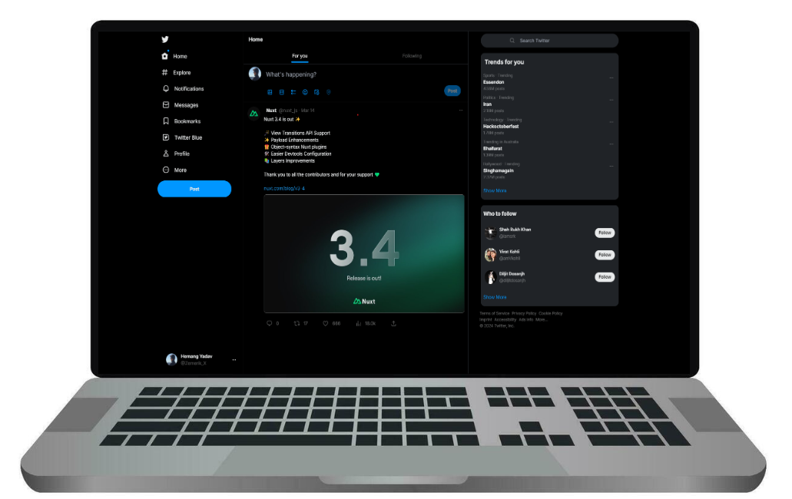

<div align = "center">


<h1>X Clone</h1>

<p>A Thrilling X Clone</p>




</div>

## 🚀 Project Structure

```text
├── assets/
│   ├── css/
│   ├── images/
├── components/
├── layouts/
├── pages/
├── public/
│   ├── images/
├── .gitignore
├── .npmrc
├── app.vue
├── README.md
├── CODE_OF_CONDUCT.md
├── CONTRIBUTING.md
├── SECURITY.md
├── LICENCE
├── nuxt.config.ts
├── package.json
├── package-lock.json
├── tailwind.config.ts
├── tailwind.config.js
└── tsconfig.json
```

## 🚀 Quick Start:

### Prerequisites:

- [NodeJS](https://nodejs.org) installed on your machine
- [GIT](https://git-scm.com) installed on your machine
- A Code Editor

### Cloning:

- To make a local copy of this Project on your machine, enter the following `GIT` Commmand in your Terminal:

```bash
git clone https://github.com/Zemerik/X-Clone
```

### Installing Dependencies:

- To run this project locally, we first need to download a few `npm` dependencies by using the command below:

```bash
npm i
```

### Locally Running:

- We can locally run this Project on our Network and see the output using the following Command of `NodeJS`:

```bash
npm run dev
```

## 😎 Happy Coding!!

## 🤝 Contributing:

Contributions are always welcome and appreciated! **Kindly visit the [CONTRIBUTING.md](https://github.com/Zemerik/X-Clone/blob/main/CONTRIBUTING.md) file for more information**


## 💁 Support:

For any kind of support or inforrmation, you are free to join our **Discord Server**,

<a href = "https://discord.gg/UF9KsmuGbr">
  
</a>

#

<p align = "center">
  Don't forget to leave a ⭐
  <br>
  Made with 💖 by <a href = "https://github.com/Zemerik">Hemang Yadav (Zemerik)</a>
</p>